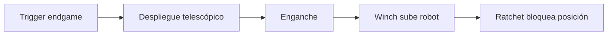

## Decisión de diseño

El climber combina un **brazo telescópico** con un **winch** y un ratchet mecánico
que mantiene la posición sin consumir corriente, liberando el motor para frenado
regenerativo. Priorizamos velocidad de escalada para asegurar puntos de endgame
incluso con poco tiempo restante.

> **TODO:** describe el mecanismo de endgame de tu robot.

## Flujo del subsistema

## Proceso de iteración

La V1 subía en ~4.2s. Cambiamos la relación del winch y el material del gancho,
logrando ~2.5s (+40% de velocidad) sin sacrificar fiabilidad.

## Lecciones aprendidas

- Un ratchet mecánico evita que el robot "ceda" si se corta la energía.
- Practicar el enganche en la driver station reduce fallos de endgame.
