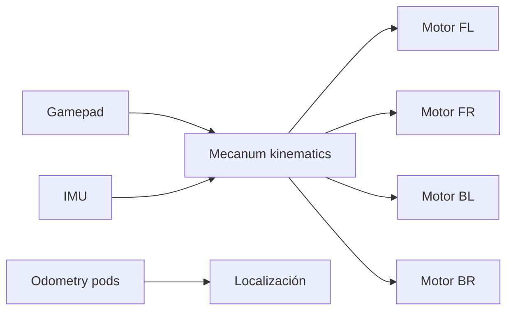

## Decisión de diseño

Elegimos una **base mecanum** porque el juego de este año premia el
reposicionamiento rápido y poder alinear el turret sin reorientar todo el robot.
La odometría con dead wheels nos da localización precisa para el auto.

> **TODO:** explica POR QUÉ elegiste este drivetrain para tu juego FTC.

## Flujo de control

## Lecciones aprendidas

- Calibrar los dead wheels antes de cada evento mejora mucho el auto.
- Mantener la misma presión en las 4 ruedas evita deriva al strafear.
