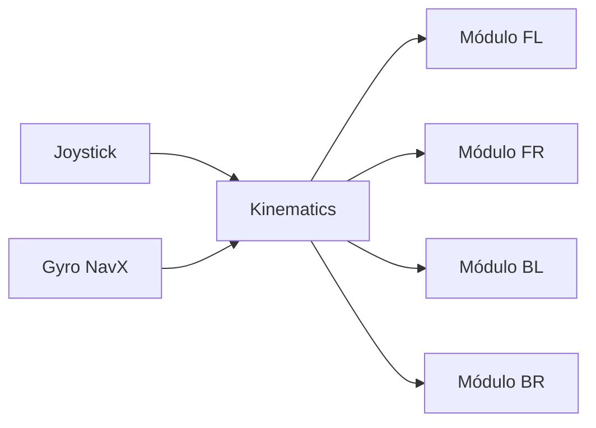

## Decisión de diseño

Elegimos un **swerve drive** porque el juego de este año premia la movilidad
omnidireccional y la capacidad defensiva. Los módulos MK4i nos dan un centro de
gravedad más bajo que los MK4 estándar, lo que mejora la estabilidad durante el
contacto defensivo.

> **TODO:** explica POR QUÉ elegiste este tipo de drivetrain para el juego de este año.

## Flujo de control

## Proceso de iteración

Durante la temporada migramos de control open-loop a closed-loop con feedforward,
lo que redujo el error de odometría en un 60%.

## Lecciones aprendidas

- Calibrar los offsets de los encoders **antes** de cada evento ahorra horas.
- Un firmware unificado de los Kraken evita desincronización entre módulos.
