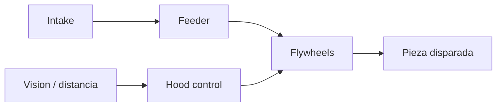

## Decisión de diseño

El shooter usa **dos flywheels contrarrotantes** con compresión ajustable para
controlar el spin de la pieza. El hood variable nos permite ajustar el ángulo de
salida según la distancia, manteniendo precisión en todo el rango efectivo.

> **TODO:** describe el mecanismo principal de puntuación de tu robot.

## Flujo del subsistema

## Proceso de iteración

La V1 usaba una sola rueda y tenía dispersión inconsistente. En la V2 pasamos a
flywheels duales, lo que mejoró la consistencia de tiro de ~70% a ~94%.

## Lecciones aprendidas

- Mantener los flywheels a RPM objetivo **antes** de alimentar reduce el tiempo de spin-up.
- El compuesto de las ruedas se desgasta: lleva repuestos a cada evento.
