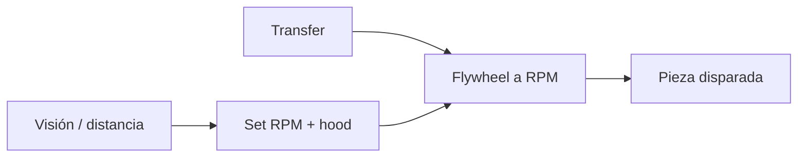

## Decisión de diseño

El **shooter de flywheel** va montado sobre el **turret**, así apuntamos sin
reorientar el robot. El control de velocidad por PIDF mantiene RPM constante para
que cada tiro salga igual.

> **TODO:** describe tu shooter real (motor, rueda, hood).

## Flujo del subsistema

## Lecciones aprendidas

- Esperar a RPM objetivo antes de alimentar reduce dispersión.
- El compuesto del flywheel se desgasta: revisa y reemplaza entre eventos.
