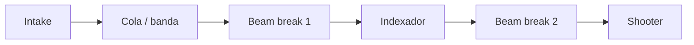

## Decisión de diseño

El **transfer** es el puente entre el intake y el shooter. Su trabajo es
**desacoplar** la recolección del disparo: el intake puede llenar la cola mientras
el shooter dispara a su propio ritmo, manteniendo cadencia constante.

> **TODO:** describe tu transfer real (banda, indexador, sensores).

## Flujo del subsistema

## Lecciones aprendidas

- Contar piezas con beam breaks evita disparos en vacío.
- Un buffer de 2-3 piezas sube mucho la cadencia efectiva en partido.
