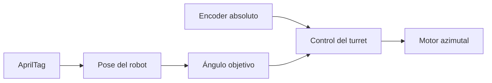

## Decisión de diseño

El **turret** desacopla el apuntado del manejo: el robot puede moverse y disparar
al mismo tiempo. Combinado con visión (AprilTags), el shooter se mantiene alineado
al objetivo automáticamente.

> **TODO:** describe tu turret real (reducción, feedback, auto-aim).

## Flujo del subsistema

## Lecciones aprendidas

- Un encoder absoluto evita "homing" del turret al inicio del partido.
- Limitar el rango (±150°) evita enredar el cableado del shooter.
